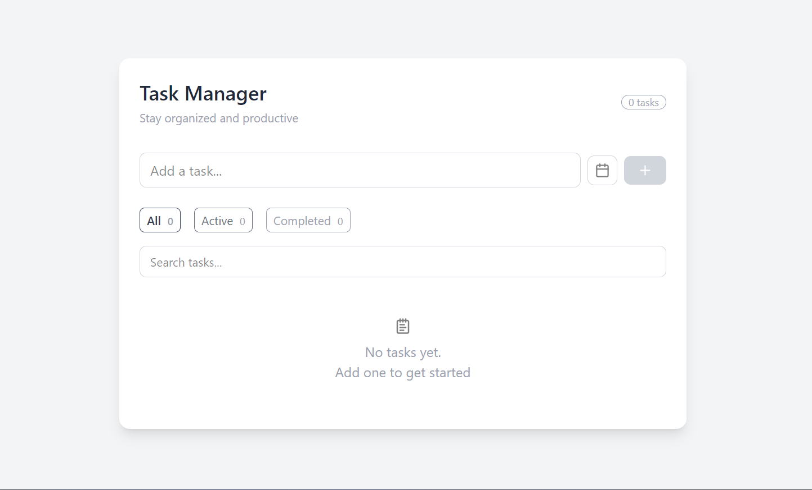

# Task Manager App

Built a Task Manager app using React, TypeScript, and Tailwind CSS with features like filtering, debounced search, due date tracking, and persistent storage using custom hooks.

---

## 🌐 Live Demo
https://task-manager-app-seven-sooty.vercel.app/

---

## ✨ Features

* ➕ Add, delete, and toggle tasks
* 📅 Set due dates with smart status:

  * Overdue
  * Due today
  * Upcoming
* 🔍 Search tasks with debounced input (better performance)
* 🎛️ Filter tasks (All / Active / Completed)
* 💾 Persistent storage using localStorage
* 🎨 Clean, responsive UI with Tailwind CSS

---

## 🛠️ Tech Stack

* **React + TypeScript** – component-based architecture with type safety
* **Tailwind CSS** – utility-first styling for fast UI development
* **Custom Hooks**:

  * `useLocalStorage` (state persistence)
  * `useDebounce` (optimized search)

---

## Preview

<!-- Add screenshot here -->



---

## What I Focused On

This project is not just about functionality. I focused on:

* **Clean architecture** (separation of components, hooks, utils)
* **Reusable logic** (custom hooks instead of duplicated code)
* **User experience** (empty states, hover effects, feedback)
* **Performance thinking** (debounced search instead of instant filtering)

---

## 🧩 Project Structure

```
src/
  components/
  hooks/
  types/
  utils/
```

---

## ⚙️ Getting Started

```bash
git clone https://github.com/your-username/task-manager.git
cd task-manager
npm install
npm run dev
```

---

## 🚀 Future Improvements

* Drag and drop task reordering
* Dark mode support
* Backend integration (Node.js + database)
* User authentication

---

## 👨‍💻 Author

Ajay
GitHub: https://github.com/ajay020